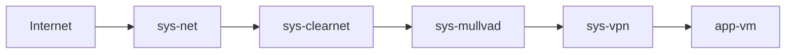

# Qubes
Collection of Qubes OS scripts and configs

# Network Setup


Notes:
- **sys-mullvad should be configured with firewall rules to only allow outgoing connections to Mullvad's IP address**
- You can add more VPN providers by appending after sys-vpn before any app-vms


# VPN Setup
Initial configuration is done using https://github.com/hkbakke/qubes-wireguard. Wireguard is the preferred software. 


# Mullvad
Use Mullvad's website to generate a Wireguard config. Using multihop is strongly reccomended.

## Automatic Key Rotation

The Wireguard key must be rotated every so often to maintain privacy. This can be done via a custom bash script that executes upon startup.

1. Copy the contents of the [mullvad folder](./mullvad) to `/rw/config/mullvad`
2. Add the line `bash /rw/config/mullvad/rotate.sh` in `/rw/config/rc.local`
3. Add your Mullvad account number in `/home/user/mullvad.txt`

Notes:
1. Key rotation must be done after a VPN connection is established, due to firewall rules
2. The existing key in your Wireguard config will be automatically revoked from Mullvad 
3. Edit the variables in [rotate.sh](./mullvad/rotate.sh) if your Wireguard config is not at `/etc/wireguard/wg0.conf`
4. The certificate at https://api.mullvad.net is validated via curl using `--cacert`. If this certificate is updated, the file [certificate.pem](./mullvad/certificate.pem) must be updated. The up to date certificate can be found at [Mullvad's github repository](https://github.com/mullvad/mullvadvpn-app/blob/master/mullvad-api/le_root_cert.pem).

# Additional VPNs
Additional VPN providers can be setup. It is strongly reccomended to daisy chain VPNs together. Each new VPN should have its own firewall vm. 

1. Create a new app-vm using the Wireguard template (Remember to check "Provides network access to other qubes" option)
2. Set Net Qube as sys-vpn
3. Start the new app-vm and configure Wireguard
4. Setup firewall rules to only allow outgoing connections to the server IP address
5. Clone sys-vpn
6. Configure new app-vms to use the previously cloned qubes as its Net Qube

# Updates proxy
Updates should be fetched via the vpn qubes and not sys-net. An alternative is to fetch updates over Tor using sys-whonix.

1. Open Qube Manager
2. Open settings for your vpn qubes (ex: sys-mullvad)
3. Go to "Services"
4. Add service "qubes-update-proxy"
5. Click "OK" to apply settings
6. Edit file `/etc/qubes-rpc/policy/qubes.UpdatesProxy` in dom0

Sample config
```
# Route whonix through sys-whonix
$tag:whonix-updatevm $default allow,target=sys-whonix
$tag:whonix-updatevm $anyvm deny

# Route all through sys-whonix
# $type:TemplateVM $default allow,target=sys-whonix

# Route tagged VM through secondary VPN
# $tag:work $anyvm allow,target=sys-vpn-2

# Route all through Mullvad
$type:TemplateVM $default allow,target=sys-mullvad

# Route all through sys-net
# $type:TemplateVM $default allow,target=sys-net

# Deny all
$type:TemplateVM $anyvm deny
```