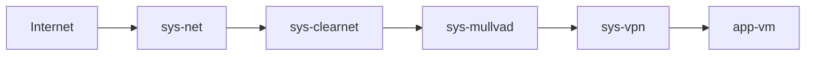

# Qubes
Collection of Qubes OS scripts and configs

# Network Setup

Notes:
- **sys-mullvad requires firewall rules to only allow outgoing connections to the Mullvad's IP address**
- You can add more VPN providers by appending after sys-vpn before any app-vms

# Mullvad

Initial configuration is done using https://github.com/hkbakke/qubes-wireguard. Wireguard is the preferred software. 

It is reccomended to use Mullvad's website to generate a Wireguard config. Use multihop if possible.

## Automatic Key Rotation

The Wireguard key must be rotated every so often to maintain privacy. This can be done via a custom bash script that executes upon startup.

1. Copy the contents of the [mullvad folder](./mullvad) to `/rw/config/mullvad`
2. Add the line `bash /rw/config/mullvad/rotate.sh` in `/rw/config/rc.local`

Notes:
1. Key rotation must be done after a VPN connection is established, due to firewall rules
2. The existing key in your Wireguard config will be automatically revoked from Mullvad 
3. Edit the variables in [rotate.sh](./mullvad/rotate.sh) if your Wireguard config is not at `/etc/wireguard/wg0.conf`